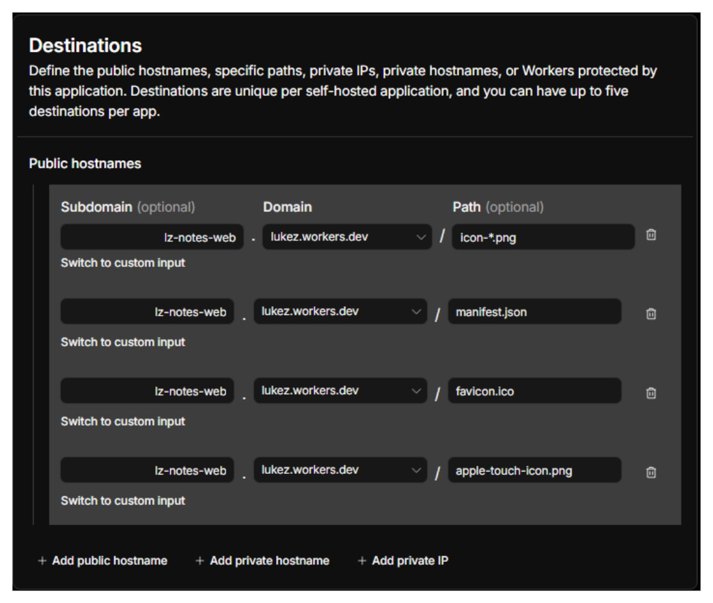
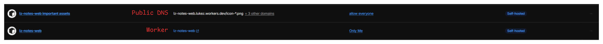

# lz-notes

Turns recorded meetings into structured notes (two flavors: regular meetings,
and "learning meetings" where one person teaches others), exportable as PDF,
DOCX, and Markdown. Speaker diarization is core — notes are generated from a
transcript that already knows who said what.

The full architecture and the decisions behind it live in [`PLAN.md`](./PLAN.md).

## Layout

pnpm workspace monorepo, one package per Cloudflare Worker:

- **`web/`** — SvelteKit app (`@sveltejs/adapter-cloudflare`). Serves the
  frontend + all HTTP API routes, and is the transcription queue **producer**.
- **`consumer/`** — small plain-TS Worker, no frontend. Queue **consumer** only;
  does the long-running Mistral transcription call and writes segments to D1.
- **`db/schema.sql`** — the D1 schema (hand-written for now; Drizzle later).

Both workers bind the **same** D1 database and R2 bucket (identical resource IDs
in both `wrangler.jsonc` files).

## Prerequisites

- Node 22+, pnpm 11+
- A Cloudflare account on the Workers **Paid** plan (headroom for long jobs)
- A Mistral API key

## Setup

```sh
pnpm install
```

### 1. Provision Cloudflare resources

```sh
wrangler d1 create lz-notes-db
wrangler r2 bucket create lz-notes-audio
wrangler queues create lz-notes-transcription-jobs
wrangler queues create lz-notes-transcription-jobs-dlq
```

Paste the `database_id` returned by `d1 create` into **both**
`web/wrangler.jsonc` and `consumer/wrangler.jsonc` (replace
`REPLACE_WITH_D1_DATABASE_ID` in each — they must match, it's one shared DB).

Apply the schema:

```sh
pnpm db:apply
```

### 2. Secrets

`MISTRAL_API_KEY` is declared as a required secret in both `wrangler.jsonc`
files, so it's validated on deploy and drives type generation.

```sh
cd web && wrangler secret put MISTRAL_API_KEY && cd ..
cd consumer && wrangler secret put MISTRAL_API_KEY && cd ..
```

For local development, copy `.env.example` to `.env` in each package
and fill in the key.

### 3. Run / typecheck / deploy

```sh
pnpm dev           # web app (vite dev) — emulates bindings from wrangler.jsonc
pnpm check         # typecheck both packages
pnpm format:check  # prettier --check . (also runs on pre-push, see below)
pnpm deploy        # deploy web + consumer (manual; CI does this on push to main, see below)
```

### 4. Git hooks

Husky runs on `pnpm install` (`prepare` script). Pre-push hook runs
`pnpm format:check` then `pnpm check` — push is blocked if either fails.
Fix locally with `pnpm format` / `pnpm check`.

## CI/CD

`.github/workflows/deploy.yml` deploys on push to `main`. Each package
deploys independently — `web` only if `web/**` (or shared `db/schema.sql`
/ lockfile) changed, `consumer` only if `consumer/**` (or those shared
paths) changed. Needs `CLOUDFLARE_API_TOKEN` and `CLOUDFLARE_ACCOUNT_ID`
repo secrets.

## Cloudflare Access Configuration

If the deployed `web` Worker sits behind a Cloudflare Access application
(recommended, since the app itself has no auth — see Notes below),
`manifest.json` and the icon files must be reachable **without** login, or
the browser's install prompt breaks. _If you **don't** care about PWA install, you can skip this section._

<details>
  <summary>Click to expand</summary>

Why: `<link rel="manifest">` is fetched by the browser in CORS mode without
credentials. Access intercepts it, 302s to the login page, and since that
redirect has no CORS headers, the browser reports it as a blocked CORS
request — not an auth error, so it's easy to misdiagnose.

Fix: Access cannot exclude one path within the same application if you've
hit the 5-hostname limit on it — add a **separate** Access application
scoped to just the static asset paths, with a **Bypass** policy
(Include Everyone):

- Public hostname: `<your-worker-hostname>`, path `/icon-*.png` (wildcard
  covers all icon variants in one row)
- Additional hostname+path rows in the same app: `/manifest.json`,
  `/favicon.ico`, `/apple-touch-icon.png`
- Policy: **Bypass**, Include Everyone



Access matches the most specific hostname+path, so this app's rules win for
those paths while the rest of the site stays behind your main Access app —
end result is two Access applications, the bypass one and the real one:



</details>

## Notes

- **No auth.** This is a single-user personal tool intended for a private URL.
  There is no authentication on any route — do not expose it publicly, or add
  auth first if you do. (PLAN §11)
- **Live status** is done by client polling (`GET /api/meetings/:id/status`),
  not WebSockets/Durable Objects.
- **Exports:** Markdown is the stored source of truth (raw LLM output); DOCX
  (`docx`) and PDF (`pdf-lib`) are generated from it on demand.
- **Glossary / context bias:** optional per-meeting field in the upload form
  (one term per line) to help transcription get names/jargon right — passed
  to Mistral as `context_bias`.
- **Installable:** static `web/static/manifest.json` + a `<link rel="manifest">`
  in `app.html` (no service worker, no PWA plugin — `@vite-pwa/sveltekit`
  didn't work in this setup).
